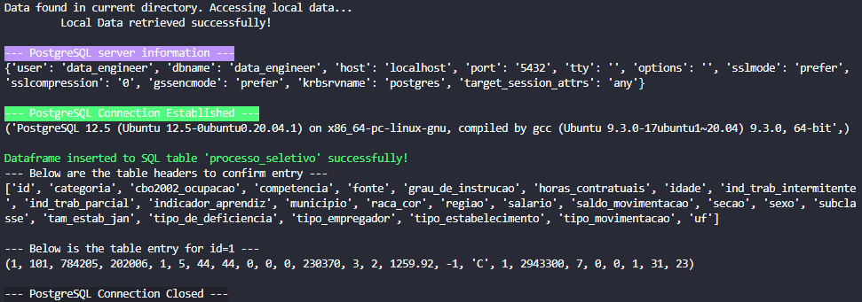

# Quero Educação - Data Engineer Job Application

Hard skills exercise for the application process to a Data Engineer position.

## Exercise Instructions

We made some public data available through an API, your challenge is to make the extraction, transformation and load this data in a database, the final table should have the schema structured according to best practices.

## Summary

The following sets up a container to host a local PostgreSQL server and a python script which performs the Extract, Transform, and Load (ETL) of the data. The python script checks if a file called ```input``` exists in it's directory. If it does not, it pulls the data from the provided API and loads it to the file with the given name, if the file already exists it just reads the data locally. It treats the data and loads it to a PostgreSQL table. Since it is stated in the assignment that the data is public, the table is set-up in the default public schema, with a generic user called ```data_engineer``` with all privileges to the database.

> *NOTE:* If the script is run outside of a container, skip the Build Instructions.

## Contents

```@root```

- Dockerfile - instructions for building the docker image and required installs
- run.sh - script to setup, start or clean container

```@/srcs```

- start.sh - PostgreSQL server start
- setup.sh - script to setup installations and configurations as required
- main.py - main script with performs ETL process
- setup_sql - ---NOT IN USE---

## Usage

### Requirements

This application is intended for use in a *Linux* based environment with *Docker*. The following instructions are for setting up the pipeline in a Docker container. All packages in ```requirements.txt``` will be installed upon running the application below.

It can be run without Docker in a *Linux* environment with ```Python3``` and ```PostgreSQL``` installed. To run without Docker, skip the "Build Container" step.

### Instructions

After cloning this repository...

**1. Build Container**

Run the following script to initiate setup:

```Shell
bash run.sh new
```

This script should make a build and image called ```quero``` and create a container
called ```quero_cont```. It will open the bash CLI for the container.

**2. PostgreSQL Installation & Setup**

The PostgreSQL setup needs to be performed at the bash CLI of the container. It
will already have the PostgreSQL server started. Enter the PostgreSQL server as the superuser as follows:

```Shell
sudo -u postgres psql
```

This will lead into a SQL CLI. Create a user, password and database as follows:

```SQL
CREATE USER data_engineer WITH PASSWORD 'quero_educacao;
CREATE DATABASE data_engineer;
GRANT ALL PRIVILEGES ON DATABASE data_engineer TO data_engineer;
```

Use ```\q``` to exit postgres.

**3. Run ETL**

Run the pipeline with the following command:

```Shell
python3 root/main.py
```
A successful run looks as follows:

